---
## Front matter
title: "Отчёт по лабораторной работе №2"
subtitle: "Дисциплина: Архитектура компьютера"
author: "Эзиз Хатамов"

## Generic otions
lang: ru-RU
toc-title: "Содержание"

## Bibliography
bibliography: bib/cite.bib
csl: pandoc/csl/gost-r-7-0-5-2008-numeric.csl

## Pdf output format
toc: true # Table of contents
toc-depth: 2
lof: true # List of figures
lot: true # List of tables
fontsize: 12pt
linestretch: 1.5
papersize: a4
documentclass: scrreprt
## I18n polyglossia
polyglossia-lang:
  name: russian
  options:
	- spelling=modern
	- babelshorthands=true
polyglossia-otherlangs:
  name: english
## I18n babel
babel-lang: russian
babel-otherlangs: english
## Fonts
mainfont: IBM Plex Serif
romanfont: IBM Plex Serif
sansfont: IBM Plex Sans
monofont: IBM Plex Mono
mathfont: STIX Two Math
mainfontoptions: Ligatures=Common,Ligatures=TeX,Scale=0.94
romanfontoptions: Ligatures=Common,Ligatures=TeX,Scale=0.94
sansfontoptions: Ligatures=Common,Ligatures=TeX,Scale=MatchLowercase,Scale=0.94
monofontoptions: Scale=MatchLowercase,Scale=0.94,FakeStretch=0.9
mathfontoptions:
## Biblatex
biblatex: true
biblio-style: "gost-numeric"
biblatexoptions:
  - parentracker=true
  - backend=biber
  - hyperref=auto
  - language=auto
  - autolang=other*
  - citestyle=gost-numeric
## Pandoc-crossref LaTeX customization
figureTitle: "Рис."
tableTitle: "Таблица"
listingTitle: "Листинг"
lofTitle: "Список иллюстраций"
lotTitle: "Список таблиц"
lolTitle: "Листинги"
## Misc options
indent: true
header-includes:
  - \usepackage{indentfirst}
  - \usepackage{float} # keep figures where there are in the text
  - \floatplacement{figure}{H} # keep figures where there are in the text
---

# Цель работы

 Целью работы является изучить идеологию и применение средств
контроля версий. Приобрести практические навыки по работе с
системой git

# Задание

1 Настройка github
2 Базовая настройка git
3 Создание SSH ключа
4 Сознание рабочего пространства и репозитория курса на основе шаблона
5 Сознание репозитория курса на основе шаблона
6 Настройка каталога курса 
7 Задания для самостоятельной раоботы 

# Теоретическое введение

**Системы контроля версий (Version Control System, VCS)**
применяются при работе нескольких человек над одним проектом.Ы
Обычно основное дерево проекта хранится в локальном или
удалённом репозитории, к которому настроен доступ для участников
проекта. При внесении изменений в содержание проекта система
контроля версий позволяет их фиксировать, совмещать изменения,
произведённые разными участниками проекта, производить откат к
любой более ранней версии проекта, если это требуется.
 В классических системах контроля версий используется
централизованная модель, предполагающая наличие единого
репозитория для хранения файлов. Выполнение большинства функций
по управлению версиями осуществляется специальным сервером.
Участник проекта (пользователь) перед началом работы посредством
определённых команд получает нужную ему версию файлов. После
внесения изменений, пользователь размещает новую версию в
хранилище. При этом предыдущие версии не удаляются из
центрального хранилища и к ним можно вернуться в любой момент.
Сервер может сохранять не полную версию изменённых файлов, а
производить так называемую дельта-компрессию — сохранять только
изменения между последовательными версиями, что позволяет
уменьшить объём хранимых данных.
 Системы контроля версий поддерживают возможность
отслеживания и разрешения конфликтов, которые могут возникнуть
при работе нескольких человек над одним файлом. Можно
объединить (слить) изменения, сделанные разными участниками
(автоматически или вручную), вручную выбрать нужную версию,
отменить изменения вовсе или заблокировать файлы для изменения.
В зависимости от настроек блокировка не позволяет другим
пользователям получить рабочую копию или препятствует изменению
рабочей копии файла средствами файловой системы ОС, обеспечивая
таким образом, привилегированный доступ только одному
пользователю, работающему с файлом.
 Системы контроля версий также могут обеспечивать
дополнительные, более гибкие функциональные возможности.
Например, они могут поддерживать работу с несколькими версиями
одного файла, сохраняя общую историю изменений до точки
ветвления версий и собственные истории изменений каждой ветви.
Кроме того, обычно доступна информация о том, кто из участников,
когда и какие изменения вносил. Обычно такого рода информация
хранится в журнале изменений, доступ к которому можно ограничить.
 В отличие от классических, в распределённых системах контроля
версий центральный репозиторий не является обязательным.
 Среди классических VCS наиболее известны CVS, Subversion, а среди
распределённых — Git, Bazaar, Mercurial. Принципы их работы схожи,
отличаются они в основном синтаксисом используемых в работе
команд

# Задания для самостоятельной работы 

**Настройка github.**
    
    Чтобы создать учетную запись в Github- е я зашёл в яндекс
браузер и написал эту ссылку в браузере https://github.com/ и
написал свои данные для создания учетной записи
  
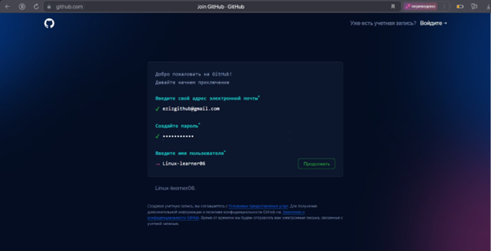{#fig:001 width=70%}

**Базовая настройка git**
 
 Впервую очередь я сделал предварительную конфигирацию git. В
терминале Я ввел нужные комманды, указав свое имя и емаил. Потом
настроил utf-8 в ввыводе сообщения git. Eщё я задал имя начальной
ветки( назвал её мастер). Потом внес параметр autocrlf и carecrlf

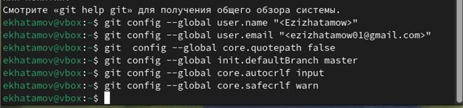{#fig:002 width=70%}
 
 **Создание SSH ключа**
   Чтобы создать SSH ключ я зашёл в терминал и ввел команду ssh
keygen -C “User.name<your_email@example.com>”. сюда написал
свои данные и ввел в терминал

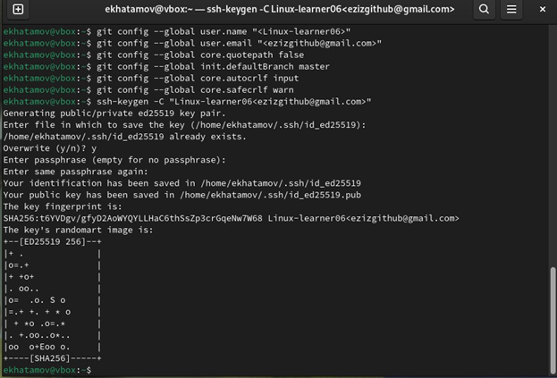{#fig:003 width=70%}

Потом скопировал этот ключ с помощью команды cat ~/.ssh/id_ed25519.pub | xclip -sel clip

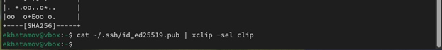{#fig:004 width=70%}

После того как скопировал ключ я перешел в свой аккаунт в гитхаб
и зашел на настройки и там есть раздел ssh and gpg keys зашел туда
и создал SSH ключ

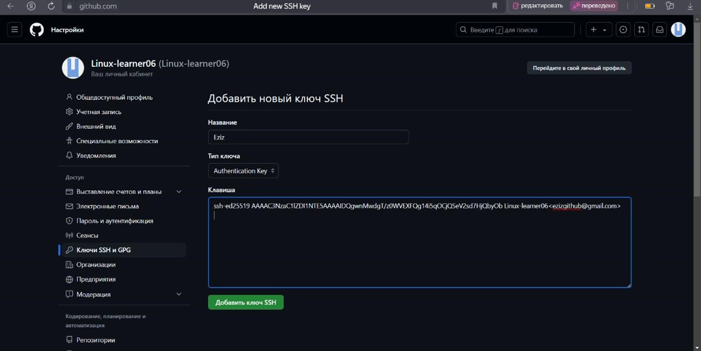{#fig:005 width=70%}

**Создание рабочего пространства и репозитория курса на основе шаблона**

Я открыл терминал и ввел нужную команду и создал каталог для
предмета Архитектура компютеров и проверил правильность своих
действий с помощью команды ls.

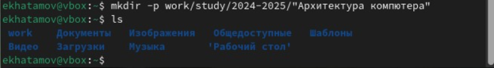{#fig:00 width=70%}

**Создание репозитория курса на основе шаблона**
     Я зашел В браузери перешел на страницу репозитория с шаблоном курса по адресу https://github.com/yamadharma/course-directorystudent-template . Далее выбрал «Use this template», чтобы использовать этот шаблон для своего репозитория
  
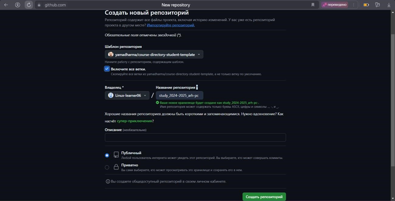{#fig:008 width=70%}

   Теперь перехожу в созданный каталог курса с помощью утилиты cd:

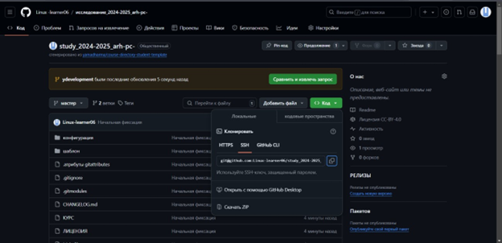{#fig:009 width=70%}

Для начало я зашел на Github и скопировал ссылку для клонирования на странице созданного репозитория Code -> SSH:

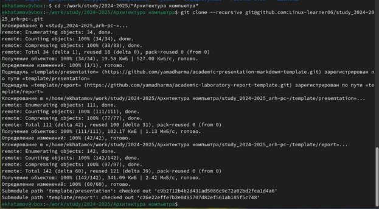{#fig:010 width=70%}

Потом зашел на терминал и ввел git clone –recursive и вставил то что
скопировал

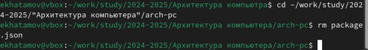{#fig:011 width=70%}

**Настройка каталога курса**

Сперва, в терминале я перехожу в каталог курса с помощью утилиты cd в каталог arch-pc и удаляю лишний файл package.json с помощью rm

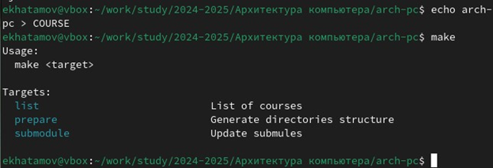{#fig:012 width=70%}

Затем создаю необходимые каталоги с помощью echo arch-pc >
COURSE

{#fig:013 width=70%}

**Теперь отправляю файлы на сервер с помощью git add .; git commit -am; git push**

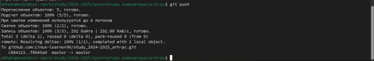{#fig:014 width=70%}

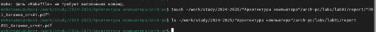{#fig:015 width=70%}

**Задания для самостоятельной работы**

1.Создал отчет по выполнению лабораторной работы в
labs/lab02/report/ с помощью утилиты touch

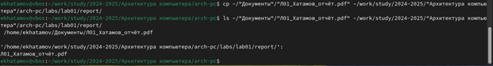{#fig:016 width=70%}

2 Потом скопировал предыдущую лабораторную работу в
соответствующий каталог. Предыдущая работа находилась в
каталоге Документы. Я воспользовался командой ср и скопировал
файл и проверил его наличие с помощью ls.

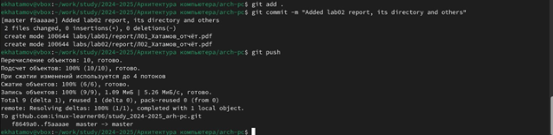{#fig:017 width=70%}

3.Теперь загружаю файлы на github используя git add .; git commit -
m; git push

{#fig:018 width=70%}

# Выводы
   При выполнении данной лабораторной работы я изучил
применение средств контроля версий, а также приобрел
практические навыки по работе с системой git и узнал как
пересылать файлы на github.

# Ответы на контрольные вопросы для самопроверки
1. Что такое системы контроля версий (VCS) и для решения каких задач они предназначаются?
 Системы контроля версий (Version Control Systems, VCS) — это инструменты, позволяющие отслеживать изменения в файлах и координировать работу над проектами, особенно в командной среде. Основные задачи VCS включают:
  1.Хранение и управление версиями файлов и папок.
  2.Отслеживание изменений, внесённых в проект.
  3. Возможность отката к предыдущим версиям файлов.
  4. Упрощение коллаборации между разработчиками.
  5. Управление конфликтами, возникающими при параллельной работе нескольких людей.
2.Объясните следующие понятия VCS и их отношения:хранилище,commit, история,рабочая копия.
- Хранилище (Repository) — это место, где сохраняются все версии файлов проекта, а также информация о всех изменениях и их авторах. Хранилище может быть локальным или удаленным.
- Commit — это команда, которая сохраняет изменения в хранилище. Каждый commit включает описание изменений и метаданные (например, автор и дата). Это позволяет отслеживать историю изменений.
- История — это последовательность всех коммитов в хранилище,в которой зафиксированы изменения, даты их внесения и авторы.
- Рабочая копия (Working Copy) — это локальная версия файлов, с которой пользователь работает. В ней находятся актуальные файлы, включая изменения, которые еще не были закоммичены.
3. Что представляют собой и чем отличаются централизованные и децентрализованные. VCS? Приведите примеры VCS каждого вида.
- Централизованные VCS (например, Subversion, CVS) работают с центральным сервером, где хранится полная версия проекта. Пользователи работают с копией проекта и по окончании вносят изменения в центральное хранилище. При работе требуется постоянное соединение с сервером.
- Децентрализованные VCS (например, Git, Mercurial) позволяют каждому пользователю иметь полную копию репозитория на своем устройстве. Изменения могут сохраняться локально, а синхронизация с удалённым репозиторием происходит по мере необходимости. Это позволяет работать без постоянного соединения, поддерживает более гибкие и дистрибутивные потоки работы.
4. Опишите действия с VCS при единоличной работе с хранилищем.
    1. Создание репозитория — инициализация нового проекта с помощью команды git init.
    2. Добавление файлов — добавление файлов в индекс с помощью команды git add.
    3. Коммит изменений — сохранение изменений в репозитории с помощью команды git commit -m "Комментарий".
    4. Просмотр истории — команда git log позволяет отслеживать все коммиты.
    5. Откат изменений — использование команды git checkout для возврата к предыдущим версиям.
5. Опишите порядок работы с общим хранилищем VCS.
    1. Клонирование репозитория — получение локальной копии общего репозитория с помощью команды git clone.
    2. Получение изменений — команда git pull для синхронизации локальной копии с удалённой (обновления).
    3. Работа над новыми изменениями — внесение изменений в рабочую копию и создание коммитов.
    4. Обновление локальной версии — решение конфликтов, если они возникли, при попытке синхронизации.
    5. Отправка изменений — отправка коммитов на удалённый репозиторий с помощью команды git push.
6. Каковы основные задачи, решаемые инструментальным средством git?
    1. Отслеживание изменений и версий файлов.
    2. Управление различными ветками разработки.
    3. Поддержка коллаборации между разработчиками.
    4. Анализ истории изменений.
    5. Управление конфликтами и слиянием веток.
7. Назовите и дайте краткую характеристику командам git.
    1. git init — инициализация нового репозитория.
    2. git clone <url> — клонирование удалённого репозитория на локальную машину.
    3. git add <file> — добавление изменений в индекс для следующего коммита.
    4. git commit -m "<message>" — сохранение изменений в репозитории с сообщением.
    5. git status — просмотр статуса рабочей копии (изменённые,добавленные файлы).
    6. git push — отправка коммитов на удалённый репозиторий.
    7. git pull — получение последних изменений из удалённого репозитория и их слияние с локальной копией.
    8. git branch — управление ветками (просмотр, создание, удаление).
    9. git checkout — переключение между ветками или возврат к предыдущим версиям. 
# Список литературы{.unnumbered}

 Компютерные науки и технологии програмирования. Раздел “Архитектура компютеров”. ( esystem.rudn.ru )
https://esystem.rudn.ru/course/view.php?id=133
https://esystem.rudn.ru/mod/resource/view.php?id=1030822
