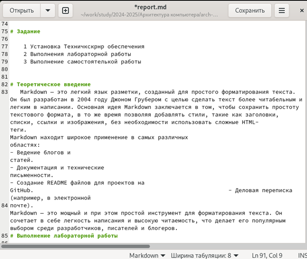

---
## Front matter
title: "Отчёт по лабораторной работе №3"
subtitle: "Дисциплина: Архитектура компьютера"
author: "Эзиз Хатамов"

## Generic otions
lang: ru-RU
toc-title: "Содержание"

## Bibliography
bibliography: bib/cite.bib
csl: pandoc/csl/gost-r-7-0-5-2008-numeric.csl

## Pdf output format
toc: true # Table of contents
toc-depth: 2
lof: true # List of figures
lot: true # List of tables
fontsize: 12pt
linestretch: 1.5
papersize: a4
documentclass: scrreprt
## I18n polyglossia
polyglossia-lang:
  name: russian
  options:
	- spelling=modern
	- babelshorthands=true
polyglossia-otherlangs:
  name: english
## I18n babel
babel-lang: russian
babel-otherlangs: english
## Fonts
mainfont: IBM Plex Serif
romanfont: IBM Plex Serif
sansfont: IBM Plex Sans
monofont: IBM Plex Mono
mathfont: STIX Two Math
mainfontoptions: Ligatures=Common,Ligatures=TeX,Scale=0.94
romanfontoptions: Ligatures=Common,Ligatures=TeX,Scale=0.94
sansfontoptions: Ligatures=Common,Ligatures=TeX,Scale=MatchLowercase,Scale=0.94
monofontoptions: Scale=MatchLowercase,Scale=0.94,FakeStretch=0.9
mathfontoptions:
## Biblatex
biblatex: true
biblio-style: "gost-numeric"
biblatexoptions:
  - parentracker=true
  - backend=biber
  - hyperref=auto
  - language=auto
  - autolang=other*
  - citestyle=gost-numeric
## Pandoc-crossref LaTeX customization
figureTitle: "Рис."
tableTitle: "Таблица"
listingTitle: "Листинг"
lofTitle: "Список иллюстраций"
lotTitle: "Список таблиц"
lolTitle: "Листинги"
## Misc options
indent: true
header-includes:
  - \usepackage{indentfirst}
  - \usepackage{float} # keep figures where there are in the text
  - \floatplacement{figure}{H} # keep figures where there are in the text
---

# Цель работы

Целью данной лабораторной работы является освоение процедуры оформления отчетов с помощью легковесного языка разметки Markdown

# Задание

    1 Установка Техничкскрнр обеспечения
    2 Выполнения лабораторной работы
    3 Выполнение самостоятелькой работы

# Теоретическое введение
   Markdown — это легкий язык разметки, созданный для простого форматирования текста. Он был разработан в 2004 году Джоном Грубером с целью сделать текст более читабельным и легким в написании. Основная идея Markdown заключается в том, чтобы сохранить простоту текстового формата, в то же время позволяя добавлять стили, такие как заголовки, списки, ссылки и изображения, без необходимости использовать сложные HTML-теги.                                                                                                                                                           Markdown находит широкое применение в самых различных областях:                                                                                                                                                                         - Ведение блогов и статей.                                                                                                                                          - Документация и технические письменности.                                                                                        - Создание README файлов для проектов на GitHub.                                                                               - Деловая переписка (например, в электронной 
почте).                                                                                                  Markdown — это мощный и при этом простой инструмент для форматирования текста. Он сочетает в себе легкость написания и высокую читаемость, что делает его популярным выбором среди разработчиков, писателей и блогеров.

# Выполнение лабораторной работы
    Для выполнения лабораторной работы, мне необходимо было установить
pandoc и LaTex, так как с помощью их можно преобразовать файлы типы .md в
.pdf и .docx

{#fig:001 width=70%}

{#fig:002 width=70%} 

{#fig:003 width=70%}

  Для выполнения лабораторной работы я для начала открыл терминал и перешёл в каталог курса сформированный при выполнении лабораторной работы №2 с помощью cd. Использовал “git pull” чтобы обновить репозиторий
  
{#fig:004 width=70%}

  Потом перешел в каталог с шаблоном отчета по лабораторной работе № 3
  
{#fig:005 width=70%}

   Я ввёл команду make, чтобы преобразовать  файл report.md в report.pdf и report.docx с помощью файла Makefile
   
{#fig:006 width=70%}

    Чтобы узнать что файлы были корректно преобразованы, я их открыл и проверил. Сперва pdf и затем docx
    
{#fig:007 width=70%}

{#fig:008 width=70%}

     Чтобы удалить полученные файлы с использованием Makefile я ввел команду make clean
     
 {#fig:009 width=70%}
 
   Потом проверил что файлы удалены
   
 {#fig:010 width=70%}
   
  Потом открыл файл report.md с помощью терминала и командой gedit report.md и начал изучать данные файла. После изучение данного файла, я заполнил данный отчет по шаблону. После заполнения отчета, я скомпилировал его и проверил корректность.
  
{#fig:011 width=70%}

# Задание для самостоятельной работы

# Выводы

Здесь кратко описываются итоги проделанной работы.

# Список литературы{.unnumbered}

::: {#refs}
:::
