---
## Front matter
title: "Отчёт по лабораторной работе №4"
subtitle: "Дисциплина: Архитектура компьютера"
author: "Хатамов Эзиз"

## Generic otions
lang: ru-RU
toc-title: "Содержание"

## Bibliography
bibliography: bib/cite.bib
csl: pandoc/csl/gost-r-7-0-5-2008-numeric.csl

## Pdf output format
toc: true # Table of contents
toc-depth: 2
lof: true # List of figures
lot: true # List of tables
fontsize: 12pt
linestretch: 1.5
papersize: a4
documentclass: scrreprt
## I18n polyglossia
polyglossia-lang:
  name: russian
  options:
	- spelling=modern
	- babelshorthands=true
polyglossia-otherlangs:
  name: english
## I18n babel
babel-lang: russian
babel-otherlangs: english
## Fonts
mainfont: IBM Plex Serif
romanfont: IBM Plex Serif
sansfont: IBM Plex Sans
monofont: IBM Plex Mono
mathfont: STIX Two Math
mainfontoptions: Ligatures=Common,Ligatures=TeX,Scale=0.94
romanfontoptions: Ligatures=Common,Ligatures=TeX,Scale=0.94
sansfontoptions: Ligatures=Common,Ligatures=TeX,Scale=MatchLowercase,Scale=0.94
monofontoptions: Scale=MatchLowercase,Scale=0.94,FakeStretch=0.9
mathfontoptions:
## Biblatex
biblatex: true
biblio-style: "gost-numeric"
biblatexoptions:
  - parentracker=true
  - backend=biber
  - hyperref=auto
  - language=auto
  - autolang=other*
  - citestyle=gost-numeric
## Pandoc-crossref LaTeX customization
figureTitle: "Рис."
tableTitle: "Таблица"
listingTitle: "Листинг"
lofTitle: "Список иллюстраций"
lotTitle: "Список таблиц"
lolTitle: "Листинги"
## Misc options
indent: true
header-includes:
  - \usepackage{indentfirst}
  - \usepackage{float} # keep figures where there are in the text
  - \floatplacement{figure}{H} # keep figures where there are in the text
---

# Цель работы

Освоение процедуры компиляции и сборки программ, написанных на ассемблере NASM.

# Задание

1. Изучение программы Hello world!
2. Транслятор NASM
3. Расширенный синтаксис командной строки NASM
4. Компоновщик LD
5. Запуск исполняемого файла
6. Выполнение заданий самостоятельной работы
7.
# Теоретическое введение

    Основными функциональными элементами любой электронно-вычислительной машины (ЭВМ) являются центральный процессор, память и периферийные устройства (рис.4.1). 
    Взаимодействие этих устройств осуществляется через общую шину, к которой они    подключены. Физически шина представляет собой большое количество проводников, соединяющих устройства друг с другом. В современных компьютерах проводники выполнены в виде электропроводящих дорожек на материнской (системной) плате.
    Основной задачей процессора является обработка информации, а также организация
координации всех узлов компьютера. В состав центрального процессора (ЦП) входят
следующие устройства:
• арифметико-логическое устройство (АЛУ) — выполняет логические и арифметические действия, необходимые для обработки информации, хранящейся в памяти;
• устройство управления (УУ) — обеспечивает управление и контроль всех устройств компьютера;
• регистры — сверхбыстрая оперативная память небольшого объёма, входящая в состав процессора, для временного хранения промежуточных результатов выполнения
инструкций; регистры процессора делятся на два типа: регистры общего назначения и
специальные регистры.
   Для того, чтобы писать программы на ассемблере, необходимо знать, какие регистры
процессора существуют и как их можно использовать. Большинство команд в программах
написанных на ассемблере используют регистры в качестве операндов. Практически все
команды представляют собой преобразование данных хранящихся в регистрах процессора,
это например пересылка данных между регистрами или между регистрами и памятью, преобразование (арифметические или логические операции) данных хранящихся в регистрах.
   Доступ к регистрам осуществляется не по адресам, как к основной памяти, а по именам. Каждый регистр процессора архитектуры x86 имеет свое название, состоящее из 2 или 3 букв латинского алфавита. В качестве примера приведем названия основных регистров общего назначения (именно эти регистры чаще всего используются при написании программ):
• RAX, RCX, RDX, RBX, RSI, RDI — 64-битные
• EAX, ECX, EDX, EBX, ESI, EDI — 32-битные
• AX, CX, DX, BX, SI, DI — 16-битные
• AH, AL, CH, CL, DH, DL, BH, BL — 8-битные (половинки 16-битных регистров). Например,
AH (high AX) — старшие 8 бит регистра AX, AL (low AX) — младшие 8 бит регистра AX.
    Таким образом можно отметить, что вы можете написать в своей программе, например,
такие команды (mov – команда пересылки данных на языке ассемблера):
mov ax, 1
mov eax, 1
  Обе команды поместят в регистр AX число 1. Разница будет заключаться только в том, что вторая команда обнулит старшие разряды регистра EAX, то есть после выполнения второй команды в регистре EAX будет число 1.А первая команда оставит в старших разрядах регистра EAX старые данные. И если там были данные, отличные от нуля, то после выполнения первой команды в регистре EAX будет какое-то число, но не 1. А вот в регистре AX будет число 1.
  Другим важным узлом ЭВМ является оперативное запоминающее устройство (ОЗУ).
ОЗУ — это быстродействующее энергозависимое запоминающее устройство, которое напрямую взаимодействует с узлами процессора, предназначенное для хранения программ и данных, с которыми процессор непосредственно работает в текущий момент. ОЗУ состоит из одинаковых пронумерованных ячеек памяти. Номер ячейки памяти — это адрес хранящихся
в ней данных.
В состав ЭВМ также входят периферийные устройства, которые можно разделить на:
• устройства внешней памяти, которые предназначены для долговременного хранения больших объёмов данных (жёсткие диски, твердотельные накопители, магнитные
ленты);
• устройства ввода-вывода, которые обеспечивают взаимодействие ЦП с внешней
средой.
В основе вычислительного процесса ЭВМ лежит принцип программного управления.
   Это означает, что компьютер решает поставленную задачу как последовательность действий,
записанных в виде программы. Программа состоит из машинных команд, которые указывают, какие операции и над какими данными (или операндами), в какой последовательности
необходимо выполнить.
  Набор машинных команд определяется устройством конкретного процессора. Коды команд представляют собой многоразрядные двоичные комбинации из 0 и 1. В коде машинной
команды можно выделить две части: операционную и адресную. В операционной части хранится код команды, которую необходимо выполнить. В адресной части хранятся данные или адреса данных, которые участвуют в выполнении данной операции.
    При выполнении каждой команды процессор выполняет определённую последовательность стандартных действий, которая называется командным циклом процессора. В самом общем виде он заключается в следующем:
    1. формирование адреса в памяти очередной команды;
    2. считывание кода команды из памяти и её дешифрация;
    3. выполнение команды;
    4. переход к следующей команде.
Данный алгоритм позволяет выполнить хранящуюся в ОЗУ программу. Кроме того, в
зависимости от команды при её выполнении могут проходить не все этапы.

# Выполнение лабораторной работы

## Изучения программы Hello world!

Для начало я создал каталог для работы с программами на языке Assambler NASM;

{#fig:001 width=70%}

Потом перехожу на созданный каталог с помощью сd

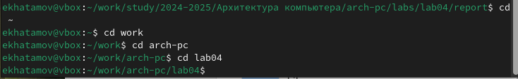{#fig:002 width=70%}

создал текстрвый файл с именем hello.asm с помощью touch

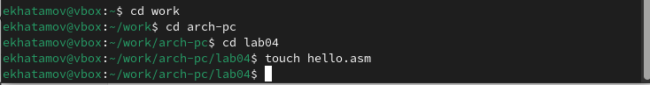{#fig:003 width=70%}

Открыл файл с помощью gedit

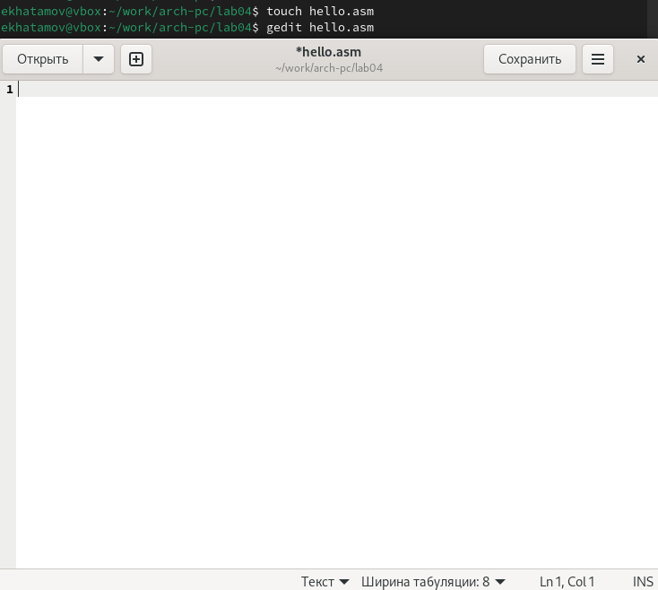{#fig:004 width=70%}

Потом ввеел туда нужные команды

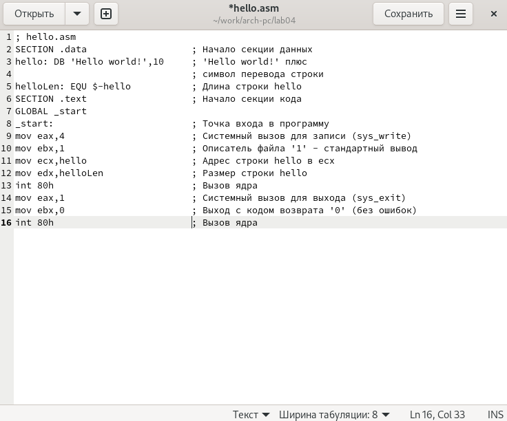{#fig:005 width=70%}

## Транслятор NASM
 С помощью кода nasm -f elf  превращаю свой текст в обьектный код

{#fig:006 width=70%}

## Расширенный синтаксис командной строки NASM

C помощью следуюшей командой я скомпилирую исходный файл hello.asm в obj.o

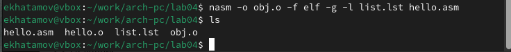{#fig:007 width=70%}

## Компоновщик LD

 С помощью команды ld -m elf_i386 hello.o -o hello я передаю файл на обработку компоновщику

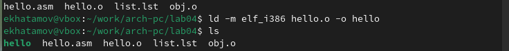{#fig:008 width=70%}

 Потом я ввел следующую команду
 
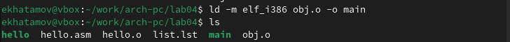{#fig:009 width=70%}

## Запуск исполняемого файла

Восле этих действ я запускаю на выполнения созданный исполняемый файл

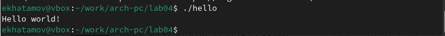{#fig:010 width=70%}
 
#  Задание для самостоятельной работы

1. В новом созданном каталоге с помощью cp создал копию файла с именем lab4.asm 

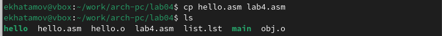{#fig:011 width=70%}

2. В текстовом редакторе внес вместо "Hello world" своё имя и фамилию на файле lab4.

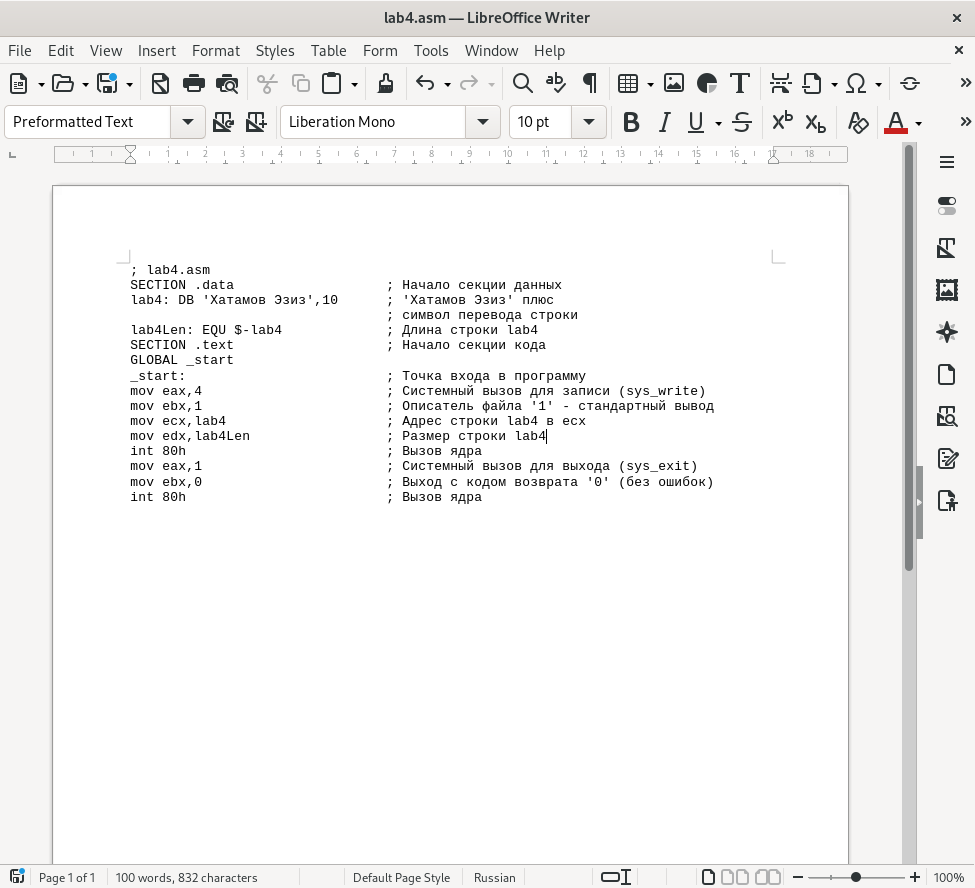{#fig:012 width=70%}

 3. Транслировал текст файла lab4,asm в обьектный файл.Выполнил компоновку объектного файла и запустил получившийся исполняемый файл
 
 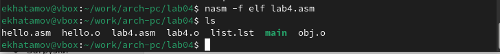{#fig:013 width=70%}
 
 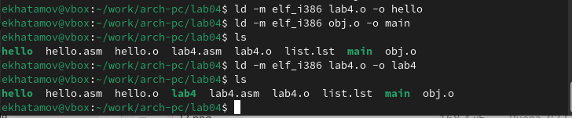{#fig:015 width=70%}

4. Потом я скопирую файлы hello.asm и lab4.asm в мой локальный репозиторий в главный каталог

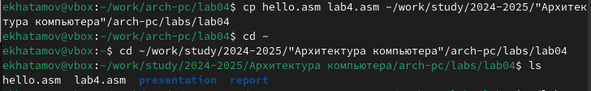{#fig:016 width=70%}
 
 После копирования я запустил на выполнение созданный исполняемый файл чтобы убедиться все ли работает
 
 
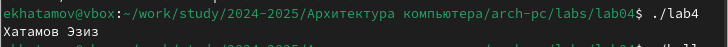{#fig:017 width=70%}

Все готова теперь спокойно смогу все вложить в Github

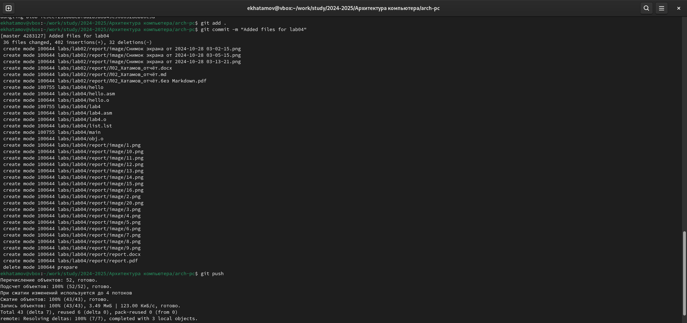{#fig:018 width=70%}

# Выводы

В ходе данной лабораторной работы я освоил процедуры компиляции и сборки программ, написанных на ассемблере NASM.

# Список литературы{.unnumbered}

 1.Архитектура ЭВМ - РУДН
:::
:::
