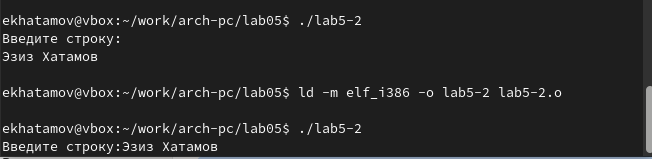

---
## Front matter
title: "Отчёта по лабораторной работе №5"
subtitle: "Дисциплина: архитектура компьютера"
author: "Эзиз Хатамов"

## Generic otions
lang: ru-RU
toc-title: "Содержание"

## Bibliography
bibliography: bib/cite.bib
csl: pandoc/csl/gost-r-7-0-5-2008-numeric.csl

## Pdf output format
toc: true # Table of contents
toc-depth: 2
lof: true # List of figures
lot: true # List of tables
fontsize: 12pt
linestretch: 1.5
papersize: a4
documentclass: scrreprt
## I18n polyglossia
polyglossia-lang:
  name: russian
  options:
	- spelling=modern
	- babelshorthands=true
polyglossia-otherlangs:
  name: english
## I18n babel
babel-lang: russian
babel-otherlangs: english
## Fonts
mainfont: IBM Plex Serif
romanfont: IBM Plex Serif
sansfont: IBM Plex Sans
monofont: IBM Plex Mono
mathfont: STIX Two Math
mainfontoptions: Ligatures=Common,Ligatures=TeX,Scale=0.94
romanfontoptions: Ligatures=Common,Ligatures=TeX,Scale=0.94
sansfontoptions: Ligatures=Common,Ligatures=TeX,Scale=MatchLowercase,Scale=0.94
monofontoptions: Scale=MatchLowercase,Scale=0.94,FakeStretch=0.9
mathfontoptions:
## Biblatex
biblatex: true
biblio-style: "gost-numeric"
biblatexoptions:
  - parentracker=true
  - backend=biber
  - hyperref=auto
  - language=auto
  - autolang=other*
  - citestyle=gost-numeric
## Pandoc-crossref LaTeX customization
figureTitle: "Рис."
tableTitle: "Таблица"
listingTitle: "Листинг"
lofTitle: "Список иллюстраций"
lotTitle: "Список таблиц"
lolTitle: "Листинги"
## Misc options
indent: true
header-includes:
  - \usepackage{indentfirst}
  - \usepackage{float} # keep figures where there are in the text
  - \floatplacement{figure}{H} # keep figures where there are in the text
---

# Цель работы

Целью данной лабораторной работы является приобретение практических навыков работы в Midnight Commander, освоение инструкций языка ассемблера mov и int.

# Задание

1.	Основы работы с Midnight Commander
2.	Структура программы на языке ассемблера NASM
3.	Подключение внешнего файла
4.	Выполнение заданий для самостоятельной работы

# Теоретическое введение

  Midnight Commander (или просто mc) — это программа, которая позволяет просматривать
структуру каталогов и выполнять основные операции по управлению файловой системой,
т.е. mc является файловым менеджером. Midnight Commander позволяет сделать работу с
файлами более удобной и наглядной.
  Следующие комбинации клавиш облегчают работу с Midnight Commander:
• Tab используется для переключениями между панелями;
• ↑ и ↓ используется для навигации, Enter для входа в каталог или открытия файла
(если в файле расширений mc.ext заданы правила связи определённых расширений
файлов с инструментами их запуска или обработки);
• Ctrl + u (или через меню Команда > Переставить панели ) меняет местами содержимое
правой и левой панелей;
• Ctrl + o (или через меню Команда > Отключить панели ) скрывает или возвращает панели
Midnight Commander, за которыми доступен для работы командный интерпретатор
оболочки и выводимая туда информация.
• Ctrl + x + d (или через меню Команда > Сравнить каталоги ) позволяет сравнить содержимое каталогов, отображаемых на левой и правой панелях.
   Дополнительную информацию о Midnight Commander можно получить по команде man
mc.

# Выполнение лабораторной работы

## открытие МС
 Для начала я открыл Midnight Commander
 (рис. [-@fig:001]).

{#fig:001 width=70%}

##Создание папки
 Потом перешел на каталог созданная в 4 лабораторной работе work/arch-pc и там создал новую папку с помощью F7

{#fig:002 width=70%}

##Создание файла

 После я создал файл lab5-1.asm с помощью команды touch в созданной папке

{#fig:003 width=70%}

##Редактирование файла
 С помощью клавиши F4 я открыл файл и внес редактирования как было указанаю Потом сохранил и закрыл файл

{#fig:004 width=70%}
 
С помощью клавиши F3 проверил что файл содержит текст которую я написал

{#fig:005 width=70%}
##Оттранслирования текста в объектный файл. Компановка файла
Оттранслировал текст программы lab5-1.asm в объектный файл.Потом выполнил компоновку объектного файла и запустил получившийся исполняемый файл. На строку 'Введите строку:' написал свое ФИО

{#fig:006 width=70%}

## Подключения внешнего файла 

Для начала скачал файл in_out.asm  со страницы курса в ТУИС. Когда скачалб этот файл лежал в каталоге "Загрузки". Поэтому я в другой панели открыл каталог "Загрузки" и с помощью клавищи F5 я скопировал файл в тот каталог в котором лежал lab5-1.asm

{#fig:007 width=70%}

Потом исправил текст программы в файле с использованием подпрограммы врешнего файла in_out.asm.

{#fig:008 width=70%}

После этого я создал исполняемый файл и проверил его работу

{#fig:009 width=70%}

Потом сменил sprintLF на sprint

{#fig:010 width=70%}

Разница между первым исполняемым файлом и вторым в том, что запуск первого запрашивает ввод с новой строки, а программа, которая исполняется при запуске второго, запрашивает ввод без переноса на новую строку, потому что в этом заключается различие между подпрограммами sprintLF и sprint.

{#fig:011 width=70%}

#  Задание для самостоятельной работы
## Первая работа
 
 Для начало я создал копию файла lab5-1.asm  и исправил текст программыб чтобы она работола по алгоритму: 
 • Вывести приглашения типа "Введите строку"
 • Ввести строку с клавиатуры
 • Вывести введённую строку на экран
  
 {#fig:012 width=70%}

Потом создал исполняемый файл и проверил его работу

  {#fig:013 width=70%}
  
## Вторая работа

Для начала я создал копия файла lab5-2.asm. Потом исправил текст программы с использованиям подпрограммы из внешнего файла in_out.asm, Так чтобы она работала по следующему
алгоритму:
• вывести приглашение типа “Введите строку:”;
• ввести строку с клавиатуры;
• вывести введённую строку на экран
 
 {#fig:014 width=70%}
 
Потом создал исполняемый файл и проверил его работу

 {#fig:015 width=70%}
  
# Выводы

При выполнении данной лабораторной работы я приобрел практические навыки работы в Midnight Commander, а также освоила инструкции языка ассемблера mov и int.

# Список литературы{.unnumbered}

1.	Лабораторная работа №6
