---
## Front matter
title: "Отчёт по лабораторной работе №6"
subtitle: "Дисциплина: архитектура компьютера"
author: "Хатамов Эзиз"

## Generic otions
lang: ru-RU
toc-title: "Содержание"

## Bibliography
bibliography: bib/cite.bib
csl: pandoc/csl/gost-r-7-0-5-2008-numeric.csl

## Pdf output format
toc: true # Table of contents
toc-depth: 2
lof: true # List of figures
lot: true # List of tables
fontsize: 12pt
linestretch: 1.5
papersize: a4
documentclass: scrreprt
## I18n polyglossia
polyglossia-lang:
  name: russian
  options:
	- spelling=modern
	- babelshorthands=true
polyglossia-otherlangs:
  name: english
## I18n babel
babel-lang: russian
babel-otherlangs: english
## Fonts
mainfont: IBM Plex Serif
romanfont: IBM Plex Serif
sansfont: IBM Plex Sans
monofont: IBM Plex Mono
mathfont: STIX Two Math
mainfontoptions: Ligatures=Common,Ligatures=TeX,Scale=0.94
romanfontoptions: Ligatures=Common,Ligatures=TeX,Scale=0.94
sansfontoptions: Ligatures=Common,Ligatures=TeX,Scale=MatchLowercase,Scale=0.94
monofontoptions: Scale=MatchLowercase,Scale=0.94,FakeStretch=0.9
mathfontoptions:
## Biblatex
biblatex: true
biblio-style: "gost-numeric"
biblatexoptions:
  - parentracker=true
  - backend=biber
  - hyperref=auto
  - language=auto
  - autolang=other*
  - citestyle=gost-numeric
## Pandoc-crossref LaTeX customization
figureTitle: "Рис."
tableTitle: "Таблица"
listingTitle: "Листинг"
lofTitle: "Список иллюстраций"
lotTitle: "Список таблиц"
lolTitle: "Листинги"
## Misc options
indent: true
header-includes:
  - \usepackage{indentfirst}
  - \usepackage{float} # keep figures where there are in the text
  - \floatplacement{figure}{H} # keep figures where there are in the text
---

# Цель работы

 Цель данной лабораторной работы - освоение арифметческих инструкций языка ассемблера NASM.

# Задание

1.	Символьные и численные данные в NASM
2.	Выполнение арифметических операций в NASM
3.	Выполнение заданий для самостоятельной работы

# Теоретическое введение

Большинство инструкций на языке ассемблера требуют обработки операндов. Адрес операнда предоставляет место, где хранятся данные, подлежащие обработке. Это могут быть
данные хранящиеся в регистре или в ячейке памяти. Далее рассмотрены все существующие
способы задания адреса хранения операндов – способы адресации.
Существует три основных способа адресации:
• **Регистровая адресация** – операнды хранятся в регистрах и в команде используются
имена этих регистров, например: mov ax,bx.
• **Непосредственная адресация**– значение операнда задается непосредственно в команде, Например: mov ax,2.
• **Адресация памяти** – операнд задает адрес в памяти. В команде указывается символическое обозначение ячейки памяти, над содержимым которой требуется выполнить
операцию.
Например, определим переменную intg DD 3 – это означает, что задается область памяти
размером 4 байта, адрес которой обозначен меткой intg. В таком случае, команда
mov eax,[intg]
копирует из памяти по адресу intg данные в регистр eax. В свою очередь команда
mov [intg],eax
запишет в память по адресу intg данные из регистра eax.
Также рассмотрим команду
mov eax,intg
В этом случае в регистр eax запишется адрес intg. Допустим, для intg выделена память
начиная с ячейки с адресом 0x600144, тогда команда mov eax,intg аналогична команде mov
eax,0x600144 – т.е. эта команда запишет в регистр eax число 0x600144.

# Выполнение лабораторной работы
## Символьные и численные данные в NASM

Для начала я создал каталог для программам лабораторной работы №6,  потом перешел на этот каталог и создал файл lab6-1.asm 
 (рис. [-@fig:001]).

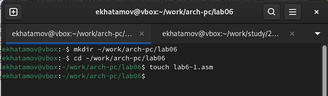{#fig:001 width=70%}
 
 Потом я зашел на Midnight Commander и скопировал in_out.asm в каталог с файлом lab6-1.asm с помощью клавищи F5
 
 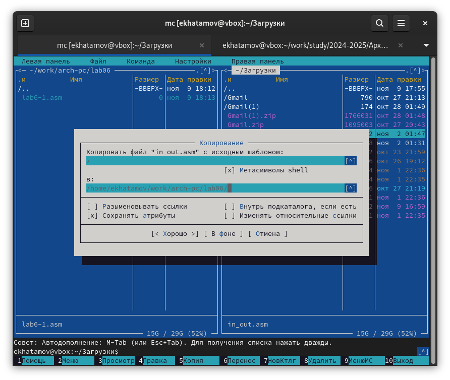{#fig:002 width=70%}

Потом я открыл созданный файл lab6-1.asm и внес изменения в тексте файла.

 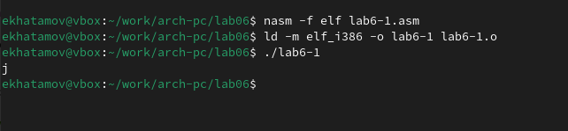{#fig:003 width=70%}
 
потом в тексте я изменил eax,'6' на eax,6 а ebx,'4'  на ebx,4 .

 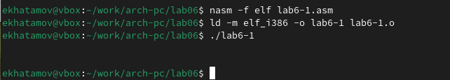{#fig:004 width=70%}
 
   Все равно не вышло число 10 а вместо него вышло пустота. я зашел и посмотрел таблицу АSCII  и там я увидел что символ числа 10 это пустота 
   
   Потом я создал новый файл в том  же каталоге в катором был прошлый файл
 
 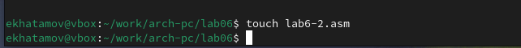{#fig:005 width=70%}

 После того как я создал файл я зашел на него и изменил текст файла
 
  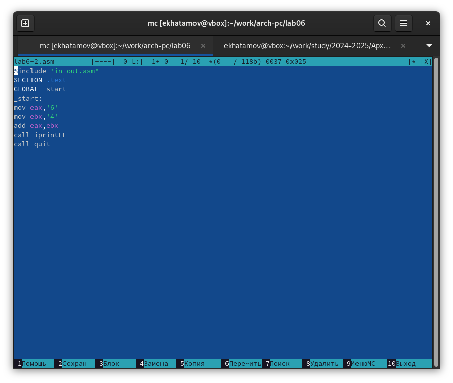{#fig:006 width=70%}
  
 Создал исполняемый файл и запустил его
 
 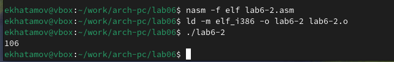{#fig:007 width=70%}
 
 Потом заменил где eax '6' и eax '4' на ebx,6 и ebx,4
 
 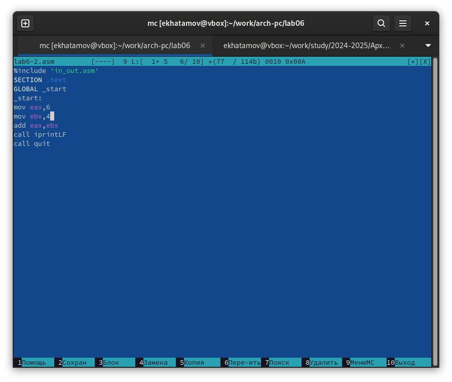{#fig:008 width=70%}
 
 После изменения я создал исполняемый файл и запустил его 
  
 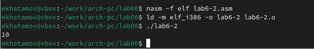{#fig:009 width=70%}
  
После этих изменений я получил цифру 10. Потом я изменил iprintLF на iprint 

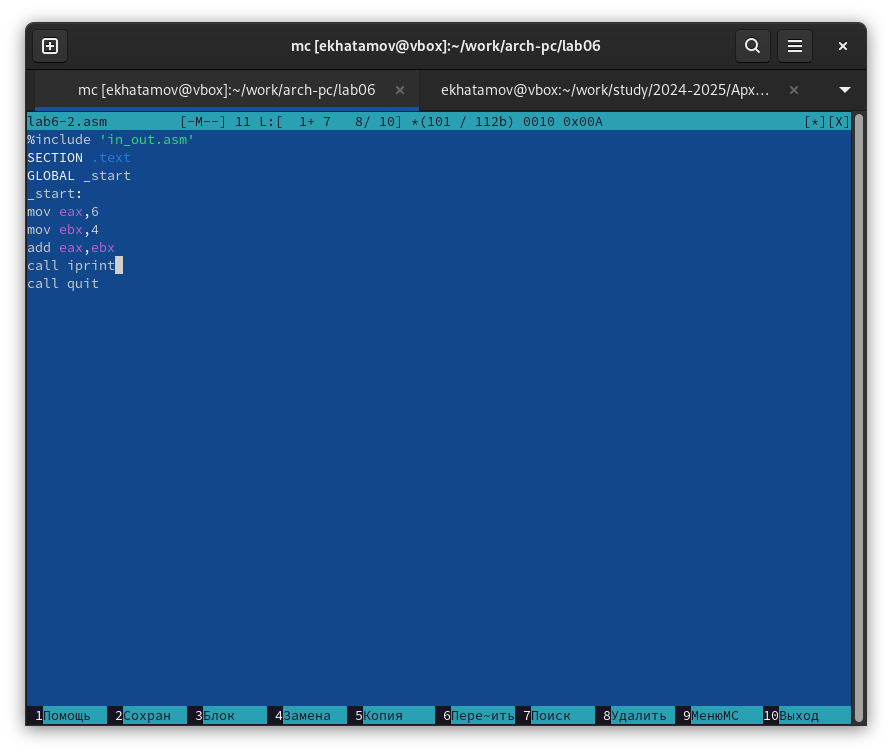{#fig:010 width=70%}

 После изменения я занова создал исполняемый файл и запустил его
 
 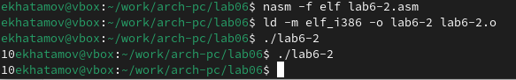{#fig:011 width=70%}
 
 Таким образом, разница между iprintLF и iprint в NASM заключается в том, что iprintLF — это функция для печати целых чисел с переводом на новую строку, а iprint — для простой печати целых чисел без перевода на новую строку
 
## Выполнение арифметических операций в NASM
### В качестве примера выполнения арифметических операций в NASM приведем программу вычисления арифметического выражения 𝑓(𝑥) = (5 ∗ 2 + 3)/3.
  Для начала я создал файл lab6-3.asm с помощью touch потом внес изменения в текст файла
  
 {#fig:012 width=70%}
 
 Потом создал исполняемый файл lab6-3.asm и запуслтил его
 
 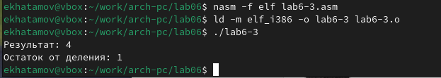{#fig:013 width=70%}
 
 Потом изменил текст программы для вычисления выражения 𝑓(𝑥) = (4 ∗ 6 + 2)/5
 
 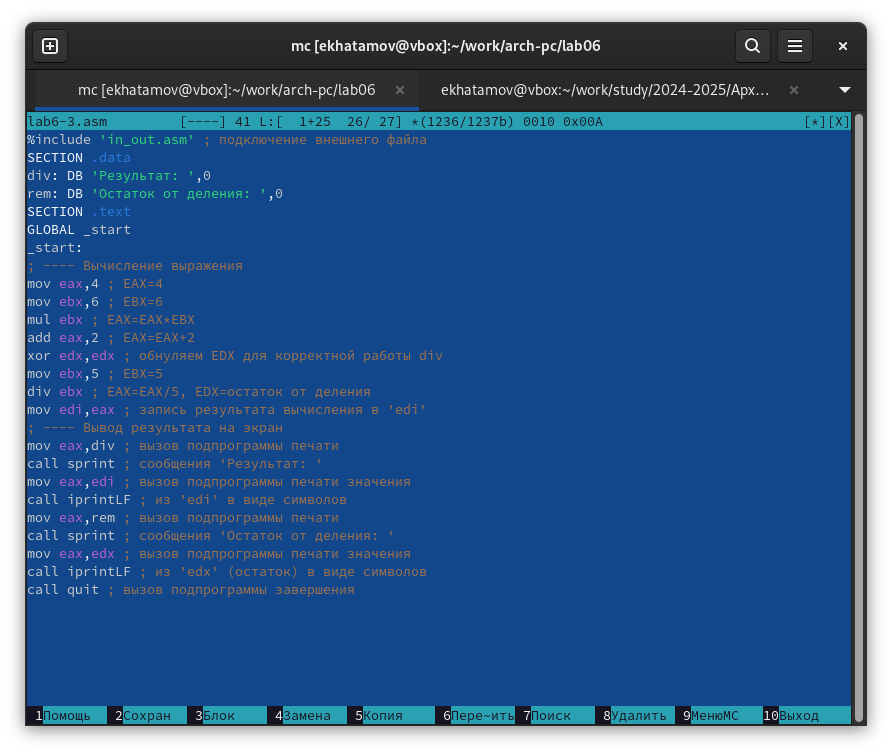{#fig:014 width=70%}
 
 Потом создал исполняемый файл lab6-3.asm и запуслтил его
 
 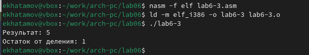{#fig:015 width=70%}
 
### В качестве другого примера рассмотрим программу вычисления варианта задания по номеру студенческого билета, работающую по следующему алгоритму:

 Для начала я создал файл variant.asm с помощью команды touch и внес в него изменения
 
 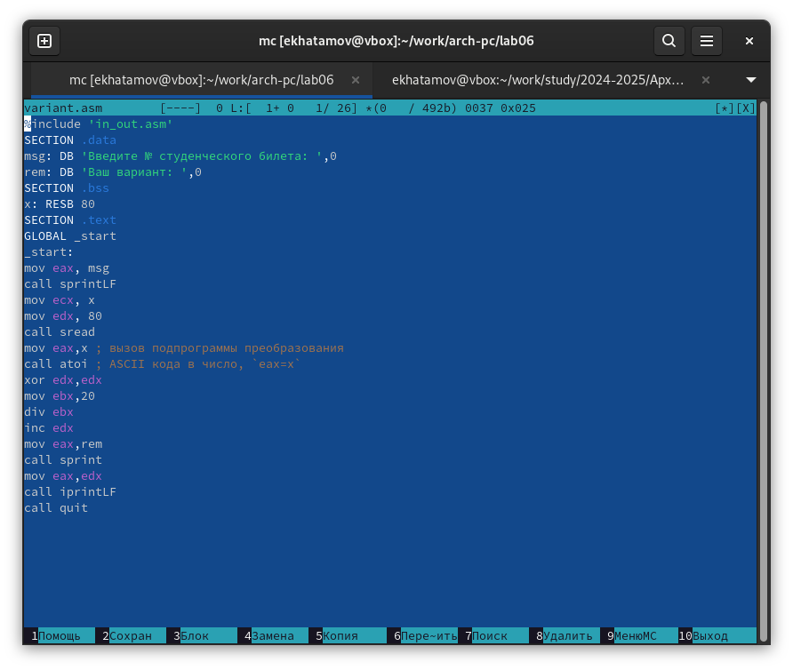{#fig:016 width=70%}
 
 Потом создал исполняемый файл запустил его
  
 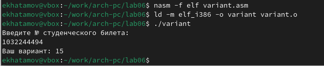{#fig:017 width=70%}
 
## Ответы на вопросы по программе
1.  Какие строки листинга 6.4 отвечают за вывод на экран сообщения ‘Ваш вариант:’?
Oтвет:За вывод сообщения “Ваш вариант” отвечают строки кода:
mov eax,rem
call sprint
2.  Для чего используется следующие инструкции?
mov ecx, x
mov edx, 80
call sread
Oтвет:Инструкция mov ecx, x используется, чтобы положить адрес вводимой строки x в регистр ecx mov edx, 80 - запись в регистр edx длины вводимой строки call sread - вызов подпрограммы из внешнего файла, обеспечивающей ввод сообщения с клавиатуры
3. Для чего используется инструкция “call atoi”?
Oтвет:Инструкция «call atoi» используется для преобразования строки в целое число. 
4. Какие строки листинга 6.4 отвечают за вычисления варианта?
Oтвет:
xor edx,edx ; обнуление edx для корректной работы div
mov ebx,20 ; ebx = 20
div ebx ; eax = eax/20, edx - остаток от деления
inc edx ; edx = edx + 1
5. В какой регистр записывается остаток от деления при выполнении инструкции “div
ebx”?
Oтвет:При выполнении инструкции div ebx остаток от деления записывается в регистр edx
6. Для чего используется инструкция “inc edx”?
Oтвет:Инструкция inc edx увеличивает значение регистра edx на 1
7. Какие строки листинга 6.4 отвечают за вывод на экран результата вычислений?
Oтвет:За вывод на экран результатов вычислений отвечают строки:
mov eax,edx
call iprintLF

# Выполнение заданий для самостоятельной работы
 Для начала я создал файл lab6-4.asm c помощью touch. И открыл файл для редактирования, ввел туда текст программы для вычисления (11+x)*2-6
 
  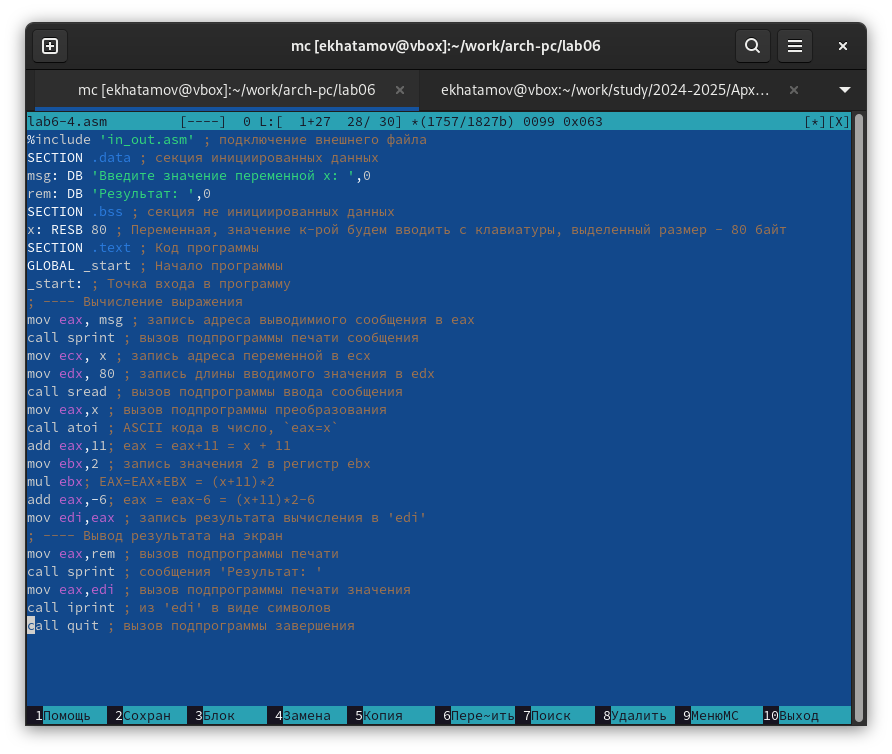{#fig:018 width=70%}

Потом создал исполняемый файл и запустил его. И ввел туда цифру 1

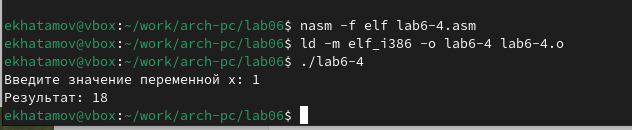{#fig:019 width=70%}

Еще раз запустил файл но в этот раз ввел цифру 9 и по алгоритму отработала верно и дал верный ответ

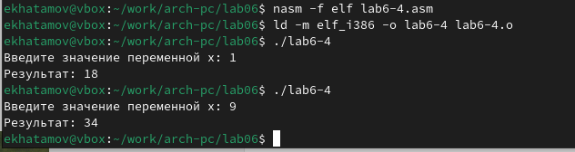{#fig:020 width=70%}

# Выводы

При выполнении данной лабораторной работы я освоила арифметические инструкции языка ассемблера NASM.

# Список литературы{.unnumbered}

1.	Лабораторная работа №7
2.	Таблица ASCII

